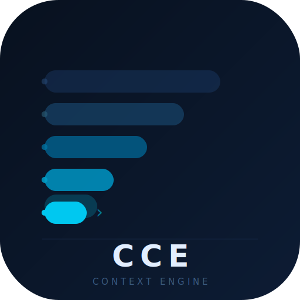

<p align="center">
  
</p>

<h1 align="center">Claude Context Engine</h1>

<p align="center">
  <strong>Index your codebase. Compress context. Cut token costs by 70%.</strong>
</p>

<p align="center">
  <a href="https://pypi.org/project/claude-context-engine/"></a>
  <a href="https://www.python.org/downloads/"></a>
  <a href="https://modelcontextprotocol.io"></a>
  <a href="https://opensource.org/licenses/MIT"></a>
  <a href="https://github.com/fazleelahhee/Claude-Context-Engine"></a>
  <a href="https://github.com/fazleelahhee/Claude-Context-Engine/issues"></a>
  <a href="https://github.com/fazleelahhee/Claude-Context-Engine/pulls"></a>
</p>

<p align="center">
  <code>pip install claude-context-engine</code>
</p>

---

A local context indexing system for [Claude Code](https://docs.anthropic.com/en/docs/claude-code) that indexes your codebase, compresses context, and serves it via MCP. Claude starts every session already knowing your project.

<p align="center">
  
</p>

---

## The Problem

Every new Claude Code session starts cold. Claude re-reads files, re-discovers architecture, and burns tokens understanding code it has seen before. On large codebases, this startup cost compounds quickly.

---

## How It Works

Claude Context Engine runs as a background daemon with four stages:

| Stage | What it does |
|-------|-------------|
| **Index** | AST-aware chunking via tree-sitter and semantic embeddings |
| **Store** | Vector database (LanceDB) and knowledge graph (Kuzu) for relationships |
| **Compress** | Local LLM (Ollama) or smart truncation to fit more in fewer tokens |
| **Serve** | MCP server gives Claude instant search, graph traversal, and session history |

```
Your Code
  │
  ▼
┌──────────────┐    ┌──────────────┐    ┌─────────────┐
│  Tree-sitter  │───▶│   LanceDB    │───▶│  MCP Server │───▶ Claude Code
│  Chunker      │    │   + Kuzu     │    │  (stdio)    │
└──────────────┘    └──────────────┘    └─────────────┘
  │                                           ▲
  ▼                                           │
┌──────────────┐                   ┌──────────────────┐
│  Embedder    │                   │  Compressor       │
│  (MiniLM)    │                   │  (Ollama/trunc)   │
└──────────────┘                   └──────────────────┘
```

---

## Key Features

### Save Input Tokens
- Compressed summaries replace full file reads (60-80% fewer tokens with the same understanding)
- Confidence scoring surfaces only the most relevant chunks
- Progressive disclosure: summaries first, full source on demand

### Save Output Tokens
- Built-in output compression reduces response verbosity by 65-75%
- Output tokens cost **5x more** than input tokens on Claude
- Four levels: `off`, `lite`, `standard`, `max` (toggle mid-session via MCP tool)
- Code blocks, file paths, commands, and error messages are never compressed

### Faster Session Startup
- No more "let me read through the codebase" at the start of every conversation
- Bootstrap context gives Claude an instant project overview: architecture, recent changes, key decisions
- Incremental indexing means only changed files get re-processed

### Persistent Project Memory
- Session history captures decisions, code areas explored, and questions asked
- Graph relationships track which functions call what and which files import which modules
- Past sessions are searchable: Claude can recall "why did we choose X over Y?"

### Fully Local
- All data stays on your machine (or your own remote server)
- Embeddings via sentence-transformers
- Compression via Ollama with smart truncation fallback
- Optional remote mode for offloading heavy computation

---

## Installation

### PyPI

```bash
pip install claude-context-engine
```

### Homebrew (macOS)

```bash
brew tap fazleelahhee/tap
brew install claude-context-engine
```

### From Source

```bash
git clone git@github.com:fazleelahhee/Claude-Context-Engine.git
cd Claude-Context-Engine
python -m venv .venv && source .venv/bin/activate
pip install -e .

# With dev dependencies
pip install -e ".[dev]"
```

**Prerequisites:** Python 3.11+, [CMake](https://cmake.org/) (for Kuzu)

```bash
brew install cmake        # macOS
sudo apt install cmake    # Ubuntu/Debian
```

### Optional: Ollama for LLM Compression

Without Ollama, the engine falls back to smart truncation. With Ollama, it produces higher-quality summaries.

```bash
brew install ollama
ollama pull phi3:mini
```

---

## Quick Start

### 1. Initialize your project

```bash
cd /path/to/your/project
cce init
```

This installs git hooks for automatic re-indexing, creates a storage directory, and runs the initial full index.

### 2. Connect to Claude Code

Add the MCP server to your project's `.mcp.json`:

```json
{
  "mcpServers": {
    "context-engine": {
      "command": "/path/to/.venv/bin/cce",
      "args": ["serve"]
    }
  }
}
```

Restart Claude Code. The context engine tools are now available.

### 3. Available MCP Tools

| Tool | Description |
|------|-------------|
| `context_search` | Semantic search across your indexed codebase |
| `expand_chunk` | Get full source code for a compressed chunk |
| `related_context` | Find related code via graph relationships |
| `session_recall` | Recall past decisions and discussions |
| `index_status` | Check when the index was last updated |
| `reindex` | Trigger re-indexing of a file or full project |
| `set_output_compression` | Change output compression level mid-session |

---

## CLI Reference

```bash
cce init              # Initialize project and run first index
cce index             # Re-index project (incremental)
cce index --full      # Force full re-index
cce index --path src/ # Index a specific directory
cce status            # Show index stats and config
cce serve             # Start MCP server
cce serve-http        # Start HTTP API (remote mode)
cce remote-setup      # Configure remote server
```

The short command `cce` and the full `claude-context-engine` both work.

---

## Configuration

### Global Config (`~/.claude-context-engine/config.yaml`)

```yaml
remote:
  enabled: false
  host: "user@your-server"
  fallback_to_local: true

compression:
  level: standard        # minimal | standard | full
  output: standard       # off | lite | standard | max
  model: phi3:mini

embedding:
  model: all-MiniLM-L6-v2

retrieval:
  confidence_threshold: 0.5
  top_k: 20
  bootstrap_max_tokens: 10000

indexer:
  watch: true
  debounce_ms: 500
  ignore:
    - .git
    - node_modules
    - __pycache__
    - .venv
    - .env

storage:
  path: ~/.claude-context-engine/projects
```

### Per-Project Overrides (`.context-engine.yaml`)

```yaml
compression:
  level: full

indexer:
  ignore:
    - .git
    - node_modules
    - dist
    - coverage
```

### Resource Profiles

The engine auto-detects your machine's resources:

| Profile | RAM | Behavior |
|---------|-----|----------|
| **light** | < 12 GB | Minimal compression, smaller embedding batches |
| **standard** | 12-32 GB | Full local pipeline |
| **full** | 32+ GB or remote | All features enabled, larger models |

---

## How Compression Works

### Layer 1: AST-Aware Chunking

Tree-sitter parses code into semantic chunks (functions, classes, modules), eliminating dead space and creating meaningful, self-contained units.

```
Raw file (800 lines, ~12k tokens)
  → 15 function chunks + 3 class chunks
  → Only relevant chunks retrieved, not the whole file
```

### Layer 2: LLM Summarization

When Ollama is available, each chunk is summarized using type-specific prompts:

| Chunk Type | Strategy |
|-----------|----------|
| Function/Class | Signature, purpose, inputs/outputs, side effects |
| Architecture/Module | Role in system and key dependencies |
| Decision | What was decided, why, and the outcome |
| Documentation | Key info only, boilerplate removed |

A quality checker verifies that at least 40% of key identifiers survive compression. If not, it falls back to smart truncation.

### Layer 3: Smart Truncation (Fallback)

When Ollama is unavailable or quality checks fail:

- **Functions/Classes:** Extracts signature and docstring, drops body
- **Other chunks:** Truncates to level-based character limits

```python
# Original (45 lines, ~600 tokens)
def calculate_shipping(order, warehouse, method="standard"):
    """Calculate shipping cost based on weight, location, and method."""
    total_weight = sum(item.weight * item.quantity for item in order.items)
    # ... 40 more lines ...

# Compressed (3 lines, ~50 tokens)
def calculate_shipping(order, warehouse, method="standard"):
    """Calculate shipping cost based on weight, location, and method."""
```

### Compression Levels

| Level | Char Limit | Behavior |
|-------|-----------|----------|
| **minimal** | 100 | Truncation only, no LLM |
| **standard** | 300 | LLM with truncation fallback (default) |
| **full** | 800 | LLM compression; high-confidence chunks kept intact |

### Output Compression

| Level | Savings | Style |
|-------|---------|-------|
| **off** | 0% | Normal Claude responses |
| **lite** | ~30% | No filler, hedging, or pleasantries |
| **standard** | ~65% | Fragments, short synonyms, no articles |
| **max** | ~75% | Telegraphic with abbreviations and symbols |

Code blocks, file paths, commands, and security warnings are never compressed.

Toggle mid-session:

```
"Switch to max output compression"
"Turn off output compression"
```

### Confidence-Based Retrieval

| Signal | Weight | Measures |
|--------|--------|----------|
| Vector similarity | 50% | Semantic relevance to the query |
| Graph distance | 30% | Proximity via call/import graph |
| Recency | 20% | How recently the code was modified |

---

## Token Savings

### By Project Size

| Project | Without Engine | With Engine | Savings |
|---------|---------------|-------------|---------|
| Small (50 files) session start | ~8k tokens | ~2k tokens | **75%** |
| Medium (500 files) session start | ~50k tokens | ~10k tokens | **80%** |
| Large (2000+ files) session start | ~100k+ tokens | ~10k tokens | **90%+** |
| Cross-session recall | ~20k tokens | ~1k tokens | **95%** |

### Combined Input and Output Savings (Opus 4)

| Scenario | Input | Output | Total Cost | Savings |
|----------|-------|--------|-----------|---------|
| No engine | 50k | 20k | **$2.25** | |
| Input compression only | 10k | 20k | **$1.65** | 27% |
| Output compression only | 50k | 7k | **$1.28** | 43% |
| Both (default) | 10k | 7k | **$0.68** | **70%** |

### Progressive Disclosure

```
Session start:     "Here's your project overview"         →  10k tokens
Claude queries:    "Find the payment processing logic"    →   800 tokens
Claude drills in:  "Show full calculate_shipping"         →   600 tokens
                                                   Total:   11.4k tokens

Without engine:    Read payments.py + shipping.py + ...   →  45k tokens
```

---

## Supported Languages

**AST-aware chunking (tree-sitter):** Python, JavaScript, TypeScript, JSX, TSX

**Fallback chunking:** Markdown and other text files

---

## Comparison: Context Engine vs Caveman

[Caveman](https://github.com/JuliusBrussee/caveman) focuses on output compression. Here is how the two compare:

| | Claude Context Engine | Caveman |
|---|---|---|
| **Type** | Full context management system | Prompt engineering plugin |
| **Input compression** | Yes (AST chunking, vector search, LLM summarization) | No |
| **Output compression** | Yes (4 levels) | Yes (5 levels, main focus) |
| **Codebase indexing** | Yes, incremental and AST-aware | No |
| **Session memory** | Yes, persists across sessions | No |
| **Setup required** | Yes (daemon, storage, embeddings) | Zero config |
| **Agent support** | Any MCP-compatible agent | 40+ agents via hooks |
| **Commit/PR compression** | No | Yes (`caveman-commit`, `caveman-review`) |

**When to use Caveman:** You want cheaper responses with zero setup.

**When to use Context Engine:** You want full context management with codebase indexing, session memory, and savings on both input and output.

---

## Remote Mode

Offload the database and LLM compression to a more powerful server:

```yaml
remote:
  enabled: true
  host: "user@your-server"
  fallback_to_local: true

compression:
  remote_model: llama3:8b
```

The engine queries the remote server and falls back to local if unreachable.

---

## Performance Tips

- Run `init` once per project. Subsequent indexing is incremental.
- Use `standard` compression for the best balance of quality and speed.
- Keep `indexer.watch: true` to auto-reindex on save with debouncing.
- Git hooks handle post-commit re-indexing automatically.
- Use remote mode on laptops to keep local resources free.

---

## Development

```bash
pytest                                           # Run tests
pytest --cov=context_engine                     # With coverage
pytest tests/integration/test_end_to_end.py    # Specific test
```

---

## Contributing

Contributions are welcome. See [CONTRIBUTING.md](CONTRIBUTING.md) for guidelines.

1. Fork the repo
2. Create a feature branch (`git checkout -b feature/my-feature`)
3. Commit your changes (`git commit -m 'feat: add my feature'`)
4. Push and open a Pull Request

---

## Roadmap

- [ ] Tree-sitter support for Go, Rust, Java, C/C++
- [ ] Web dashboard for index inspection
- [ ] Persistent session search across projects
- [ ] Smarter graph edge detection (call graph, import resolution)

---

## License

MIT License. See [LICENSE](LICENSE) for details.

---

## Acknowledgments

[Claude Code](https://docs.anthropic.com/en/docs/claude-code) by Anthropic,
[MCP](https://modelcontextprotocol.io),
[LanceDB](https://lancedb.com/),
[Kuzu](https://kuzudb.com/),
[Tree-sitter](https://tree-sitter.github.io/),
[Ollama](https://ollama.com/)

---

<p align="center">If this project helps you, consider giving it a star.</p>
